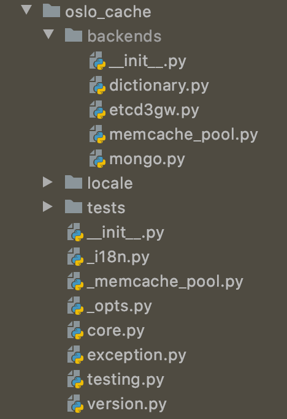

# oslo.cache  

通过dogpile.cache库实现了一个缓存机制为OpenStack其他组件提供缓存。
目前，oslo.cache支持多种缓存机制，包括Memcache、etcd 3.x、MongoDB、dictionary等。

### 1、目前oslo.cache支持的后端缓存机制  

目前，oslo.cache实现了四种后端缓存机制的支持，包括Memcache、etcd 3.x、MongoDB、dictionary等。
这些实现都保存在oslo_cache/backend目录下。
  


> oslo.cache.backend.memcache_pool: 
>>该模块提供了Memcache缓存池支持，首先实现了Memcache缓存连接池ConnectionPool，
>然后实现了PooledMemcachedBackend类对Memcache缓存连接池进行读写等操作.   

```
class PooledMemcachedBackend(memcached_backend.MemcachedBackend):

def __init__(self, arguments):
    super(PooledMemcachedBackend, self).__init__(arguments)
    self.client_pool = _memcache_pool.MemcacheClientPool(
        self.url,
        arguments={
            'dead_retry': arguments.get('dead_retry', 5 * 60),
            'socket_timeout': arguments.get('socket_timeout', 3.0),
            'server_max_value_length':
                arguments.get('server_max_value_length'),
        },
        maxsize=arguments.get('pool_maxsize', 10),
        unused_timeout=arguments.get('pool_unused_timeout', 60),
        conn_get_timeout=arguments.get('pool_connection_get_timeout', 10),
    )

@property
def client(self):
    return ClientProxy(self.client_pool)
    
```

在PooledMemcachedBackend中通过初始化配置参数，然后根据cliet()方法返回ClientProxy实例，进行读写操作
> oslo.cache.backend.etcd3gw: